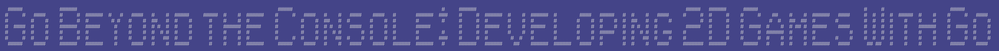
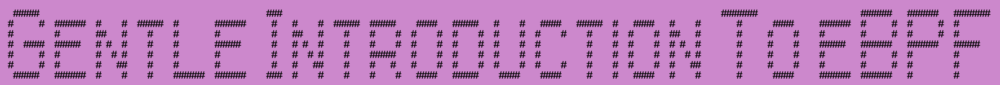
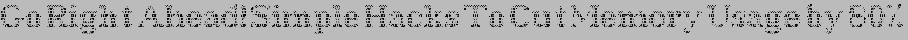

# gopherconeu23img
This repo contains a CLI that produces some proposals for images to use during gopherconeu23

## How to use it

Get it with `go install gitHub.com/mcaci/gopherconeu23img@latest` then run it as `gophercon23img $TEXT` to get a first example with the text of your choice.

There are some flags that can be used to customize the image that is produced.

This is the flag list:

- bgHex: this flag gets a string in the form of "0x" followed by 3 or 6 hexadecimal digits. The value is used to select the color of the background.
- l: this flag is just the width of the image. It's an integer.
- h: this flag is just the height of the image. It's an integer.
- fgHex: this flag gets a string in the form of "0x" followed by 3 or 6 hexadecimal digits. The value is used to select the color of the text in the foreground.
- fontPath: path for the font to use to draw the text in the foreground. It should be a path to a valid TrueType font.
- fontSize: size of the font to use to draw the text in the foreground.
- xPtFactor: this number is a factor used to determine the width of the character box for each character. It is used to adjust the alignment of each character of the ASCII art text drawn.
- yPtFactor: this number is a factor used to determine the height of the character box for each character. It is used to adjust the alignment of each character of the ASCII art text drawn.
- o: name of the output image
- figlet: name of the figlet font: figlets are fonts used to convert text into ASCII art. See https://github.com/common-nighthawk/go-figure/tree/master/fonts for the possible values and http://www.figlet.org/examples.html to see examples of what are the effects of these fonts.

These flags can be listed using the `--help` flag.

## Examples

Here are some examples with the commands run to create them:

1. go run main.go -o talk.png Go Beyond the Console: Developing 2D Games With Go

2. go run main.go -o examples/talk2.png -figlet banner3 -l 9500 -bgHex 0xabc -fgHex 0x000 Towards Modern Development of Cloud Applications With Service Weaver

3. go run main.go -o examples/talk3.png -figlet banner -l 3100 Gentle Introduction To eBPF

4. go run main.go -o examples/talk4.png -fontSize=48 -figlet larry3d -l 9500 -h 500 -bgHex 0xc0c -fgHex 0x000 Go Right Ahead! Simple Hacks To Cut Memory Usage by 80%

5. go run main.go -o examples/talk5.png -figlet roman -l 9500 -bgHex 0xabc -fgHex 0x000 Go Right Ahead! Simple Hacks To Cut Memory Usage by 80%

6. go run main.go -o examples/talk.gif -gif Go Beyond the Console: Developing 2D Games With Go

