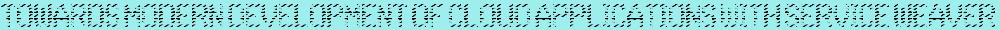
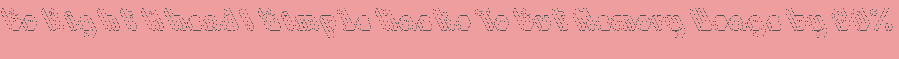
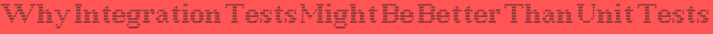
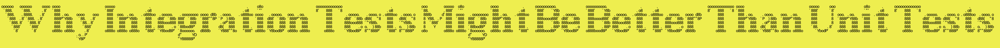
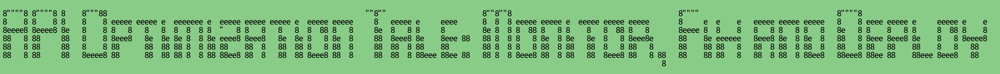

# gopherconeu23img
This repo contains a CLI that produces some proposals for images to use during gopherconeu23

## How to use it

Get it with `go install gitHub.com/mcaci/gopherconeu23img@latest` then run it as `gophercon23img $TEXT` to get a first example with the text of your choice.

There are some flags that can be used to customize the image that is produced.

This is the flag list:

- bgHex: this flag gets a string in the form of "0x" followed by 3 or 6 hexadecimal digits. The value is used to select the color of the background.
- l: this flag is just the width of the image. It's an integer.
- h: this flag is just the height of the image. It's an integer.
- fgHex: this flag gets a string in the form of "0x" followed by 3 or 6 hexadecimal digits. The value is used to select the color of the text in the foreground.
- fontPath: path for the font to use to draw the text in the foreground. It should be a path to a valid TrueType font.
- fontSize: size of the font to use to draw the text in the foreground.
- xPtFactor: this number is a factor used to determine the width of the character box for each character. It is used to adjust the alignment of each character of the ASCII art text drawn.
- yPtFactor: this number is a factor used to determine the height of the character box for each character. It is used to adjust the alignment of each character of the ASCII art text drawn.
- o: name of the output image
- figlet: name of the figlet font: figlets are fonts used to convert text into ASCII art. See https://github.com/common-nighthawk/go-figure/tree/master/fonts for the possible values and http://www.figlet.org/examples.html to see examples of what are the effects of these fonts.
- banner: if set to true it will produce a gif of a banner that shows the text sliding on the background, if false it will produce a png.
- blink: if set to true it will produce a gif of the text blinking on the background, if false it will produce a png.
- alt: if set to true it will produce a gif of the text blinking and switching colors with the background, if false it will produce a png.
- delay: used with `banner`, `blink` or `alt`, it indicates the delay between each frame of the gif.

These flags can be listed using the `--help` flag.

## Examples

Here are some examples with the commands run to create them:

1. go run main.go -o talk.png Go Beyond the Console: Developing 2D Games With Go

2. go run main.go -o examples/talk2.png -figlet banner3 -bgHex 0xabc -fgHex 0x000 Towards Modern Development of Cloud Applications With Service Weaver

3. go run main.go -o examples/talk3.png -figlet larry3d -l 5000 -h 1000 Go Right Ahead! Simple Hacks To Cut Memory Usage by 80%

4. go run main.go -o examples/talk4.png -fontSize=48 -figlet banner -bgHex 0xc9c -fgHex 0x000 Gentle Introduction To eBPF

5. go run main.go -o examples/talk5.png -figlet roman -bgHex 0xabc -fgHex 0x000 Go Right Ahead! Simple Hacks To Cut Memory Usage by 80%

6. go run main.go -o examples/talk6.png -figlet roman -bgHex 0xa23 -fgHex 0x121 Why Integration Tests Might Be Better Than Unit Tests

7. go run main.go -o examples/talk7.png -figlet 3-d -bgHex 0x423 -fgHex 0xeee Coffee Break

8. go run main.go -o examples/talk8.png -figlet dotmatrix -bgHex 0x500 -fgHex 0xeee Coffee Break 

9. go run main.go -o examples/talk9.png -figlet stellar -bgHex 0x121 -fgHex 0xfff Useful Functional-Options Tricks For Better Libraries

10. go run main.go -o examples/talk10.png -figlet speed -fgHex 0xdad GoTime Podcast Live

### Banner Gif

1. go run main.go -o examples/talk.gif -banner Go Beyond the Console: Developing 2D Games With Go

2. go run main.go -o examples/talk2.gif -banner -bgHex 0xada -fgHex 0x121 Why Integration Tests Might Be Better Than Unit Tests

3. go run main.go -o examples/talk4.gif -figlet cosmic -banner -bgHex 0x044 Reaching the Unix Philosophys Logical Extreme With WebAssembly

4. go run main.go -o examples/talk8.gif -figlet smkeyboard -banner -delay 10 Panel With the Go Team

### Blinking Gif

1. go run main.go -o examples/talk3.gif -figlet roman -blink -bgHex 0xabc -fgHex 0x000 Why Integration Tests Might Be Better Than Unit Tests

### Blinking Gif with alternating colors 

1. go run main.go -o examples/talk5.gif -figlet smkeyboard -alt Panel With the Go Team

2. go run main.go -o examples/talk6.gif -figlet computer -alt -bgHex 0xabc -fgHex 0x000 API Optimization Tale: Monitor, Fix and Deploy

3. go run main.go -o examples/talk7.gif -figlet isometric3 -alt -delay 150 -bgHex 0x959 -fgHex 0x111 Coffee Break
